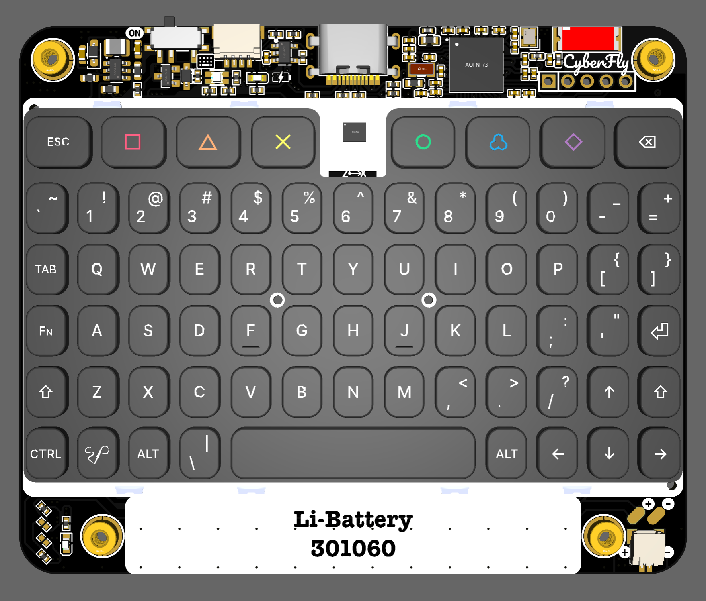

# ⌨️ TypixNode — BLE + USB 双模便携键盘 · 使用说明书

> *BLE + USB Dual-mode Portable Keyboard · User Manual · 中文 / English*

`CyberFly · nRF52840 · ZMK`

| MCU | 无线 / LINK | 蓝牙 / BT | 飞鼠 / AIR | 固件 / FW |
|---|---|---|---|---|
| nRF52840 | BLE + USB | 6 设备 | 6 轴 IMU | ZMK |

<p align="center">
  
</p>

> 本说明书内容与 16 页 PDF 版（`TypixNode_Manual.pdf`）一致，由同一份内容源（`manual_content.py`）维护。

---

# 中文使用说明 (CN)

TypixNode 是一款卡片大小的 **BLE + USB 双模** 便携键盘，基于 **nRF52840**（Nice!Nano v2 引脚兼容）+ **ZMK** 固件。支持 **最多 6 台蓝牙设备** 切换，板载 **QMI8658A 6 轴 IMU** 可作空间飞鼠，带 RGB 状态灯与白色背光。BLE 下 macOS / iOS 原生显示电量。约 **69 键**，含一个 **Fn 功能层**。

## 1 · 产品概览

| 项目 | 值 |
|---|---|
| 产品名称 | TypixNode（CyberFly 硬件）|
| 类型 | BLE + USB 双模便携键盘 |
| 主控 | nRF52840（Nice!Nano v2 兼容）|
| 固件 | ZMK（定制分支）|
| 蓝牙 | BLE 5.0，最多 **6 台设备** 配对切换 |
| 飞鼠 | QMI8658A 6 轴 IMU（加速度计 + 陀螺仪）|
| 背光 | 白色，仅 USB 通电可用 |
| 电池 | 锂聚合物 LP301060（约 250 mAh）|

> 透明亚克力 + 白色背光；底部红 / 白 LED 为充电 / USB 指示。

## 2 · 指示灯一览

| 位置 | 灯 | 含义 |
|---|---|---|
| 键盘板上方 | 🟢 RGB 灯 | 工作状态（开机动画、USB 循环、BLE 心跳、飞鼠切换）|
| RGB 旁 | 🔴 红灯 | 充电中常亮，充满自动熄灭 |
| 键盘板下方 | ⚪ 白灯 | USB 5V 供电指示，插线就亮 |

### RGB 状态详解

| 场景 | 效果 |
|---|---|
| 开机 | 红 → 绿 → 蓝 顺序闪一次后熄灭（启动动画）|
| USB 已连接 | 持续循环变换（三色轮换）|
| BLE 待机 | 🔵 蓝色双闪，每 5 秒一次心跳，代表随时可用 |
| 飞鼠切换 | OFF=🔴 红闪 / M1=🟢 绿闪 / M2=🔵 蓝闪（双闪后回归原状态）|

## 3 · 工作模式

| 模式 | 连接 | 背光 | 飞鼠 |
|---|---|---|---|
| **USB** | USB-C 线 | 可用（Fn+空格调节）| 可用 |
| **BLE** | 蓝牙 | 自动关闭（省电）| 需手动开启 |

> 背光仅 USB 通电时可用，拔线自动熄灭（`AUTO_OFF_USB`）；空闲也会自动熄灭（`AUTO_OFF_IDLE`）。

## 4 · 键位图 · 基础层 (Base)

物理键位为按 PCB 丝印呈现的标准 QWERTY。左上角小字为 **Shift** 上档符号；标记 `··` 的键支持**双击**（见第 7 节）。

```
┌─────┬────┬────┬────┬────┬────┬────┬────┬────┬────┬────┬────┬─────┐
│ ESC │ F1 │ F2 │ F3 │    │ F4 │ F5 │ F6 │    │    │    │    │ BSPC│
│     │ ■  │ ▲  │ ✕  │    │ ●  │ ♣  │ ◆  │    │    │    │    │     │
├─────┼────┼────┼────┼────┼────┼────┼────┼────┼────┼────┼────┼─────┤
│ ~ ` │ ! 1│ @ 2│ # 3│ $ 4│ % 5│ ^ 6│ & 7│ * 8│ ( 9│ ) 0│ - │ + =│
├─────┼────┼────┼────┼────┼────┼────┼────┼────┼────┼────┼────┼─────┤
│ TAB │ Q  │ W  │ E  │ R  │ T  │ Y  │ U  │ I  │ O  │ P  │ [ │  ] │
├─────┼────┼────┼────┼────┼────┼────┼────┼────┼────┼────┼────┼─────┤
│ Fn  │ A  │ S  │ D  │ F  │ G  │ H  │ J  │ K  │ L  │ ; │ '  │ ⏎  │
├─────┼────┼────┼────┼────┼────┼────┼────┼────┼────┼────┼────┼─────┤
│Shift│ Z  │ X  │ C  │ V  │ B  │ N  │ M  │ , │ . │ / │ ↑  │Shift│
├─────┼────┼────┼────┼──────────────────────┼────┼────┼────┼─────┤
│CTRL │GUI │ALT │ \  │        SPACE         │ALT │ ← │ ↓  │  →  │
└─────┴────┴────┴────┴──────────────────────┴────┴────┴────┴─────┘
```

> `■ ▲ ✕ ● ♣ ◆` = 顶部 6 个彩色符号键 = F1–F6；`··` = 双击有隐藏功能；左上小字 = Shift 上档。

## 5 · 键位图 · Fn 层

按住左侧 **Fn** 键（CapsLock 位）时，高亮键生效，灰色为透传。🟦 蓝色 = 蓝牙/输出相关，🟪 紫色 = 其它功能。

| 按住 Fn + | 功能 |
|---|---|
| **Esc** | 切换 USB / BLE 输出（`OUT_TOG`）|
| **■ ▲ ✕ ● ♣ ◆** | 切换到蓝牙设备 1–6（`BT_SEL 0–5`）|
| **Enter** | 清除**当前蓝牙设备**的配对（`BT_CLR`），用于重新配对该槽位 |
| **1 ~ 0 / - / =** | F1 ~ F10 / F11 / F12 |
| **Backspace** | Delete |
| **↑ / ↓ / ← / →** | PgUp / PgDn / Home / End |
| **空格 Space** | 循环切换背光亮度（`BL_CYCLE`）|
| **左 Alt / 右 Alt** | 开 / 关 6 轴飞鼠（OFF → M1 → M2 循环）|
| **右 Shift（按住）** | 软关机（`soft_off`）|
| **]** | 外接电源开关（`EP_TOG`）|
| **Q / A / M** | 截图宏 / 全选复制宏 / `() => {}` 宏 |
| **C** | 🌟 重置全部设置（清 NVS）并重启 |
| **B** | 进入 Bootloader（UF2 刷机）|

## 6 · 蓝牙多设备连接

固件支持 **最多 6 台蓝牙设备**（`CONFIG_BT_MAX_PAIRED=6`），通过 Fn + 顶部符号键在 6 个槽位间切换。

| 操作 | 按键 |
|---|---|
| 选择 / 切换到设备 1–6 | Fn + ■ / ▲ / ✕ / ● / ♣ / ◆ |
| 清除当前设备配对（重新配对该槽位）| Fn + Enter |
| 切换 USB / 蓝牙 输出 | Fn + Esc |
| 重置全部设置（清空所有配对 + 重启）| Fn + C 🌟 |

### 配对流程

1. **Fn + 符号键** 选一个空槽位（如设备 1 = Fn + ■）。
2. 键盘进入广播，在主机蓝牙设置里搜索 `TypixNode KBD` 并配对。
3. 连接后，系统「我的设备」即显示电量。
4. 换主机：**Fn + 另一个符号键** 切到别的槽再配对即可——各设备互不覆盖。

> **两种清除的区别：**
> - **Fn + Enter** = 只清当前这台的配对（其它设备保留）。
> - **Fn + C** = 核弹级，清空全部配对、设备名缓存等所有设置并重启，配对全乱时用它。

### 电量显示

- **macOS**：系统设置 → 蓝牙 → 「我的设备」卡片。
- **iOS / iPadOS**：桌面加「电池」小组件。
- 协议：标准 **BLE Battery Service (0x180F)**。

## 7 · 隐藏技巧：双击 / Combo / 宏

### 双击 (Tap-dance)

| 键 | 单击 | 双击 |
|---|---|---|
| **Esc** | Esc | Caps Word（一次性大写，遇空格退出）|
| **左 Shift** | Shift | 锁定 Caps Lock |

### Combo 组合键（同时按）

| 同按 | 触发 | 判定窗口 |
|---|---|---|
| J + K | Esc | 50 ms |
| D + F | Tab | 50 ms |
| F + J | Enter | 50 ms |
| J + K + L | Caps Word | 50 ms |
| Fn + 右 Shift | 开 / 关飞鼠 | 75 ms |

### 宏（Fn 层）

| 键 | 宏效果 |
|---|---|
| Fn + Q | 截屏（⌘ + Shift + 4）|
| Fn + A | 全选 + 复制（Ctrl+A → 50ms → Ctrl+C）|
| Fn + M | 输入 `() => {}` 箭头函数 |

> **关于 Fn + 右 Shift：** 75ms 内**同时**按下触发飞鼠切换；**分前后**按则走 Fn 层的**软关机**。想关机就慢点按，想切飞鼠就同时按下。

## 8 · 6 轴飞鼠（Air Mouse）

板载 **QMI8658A** 6 轴 IMU（加速度计 + 陀螺仪，I²C）。三档循环切换：

| 模式 | 算法 | 状态灯 | 风格 |
|---|---|---|---|
| **OFF** | 关闭，IMU 进省电 | 🔴 红闪 | 纯键盘 |
| **M1** | Kalman 滤波 + 状态空间融合 | 🟢 绿闪 | 稳 |
| **M2** | 加速度倾角映射（简易回退）| 🔵 蓝闪 | 跟手 |

三种切换方式：Fn + 右 Shift（75ms 同按）、Fn + 左 Alt、Fn + 右 Alt。切换时 RGB 对应颜色双闪确认。

### Smart Space：飞鼠开启后空格键变鼠标

| 位置 | OFF | ON (M1/M2) |
|---|---|---|
| 左空格 | 空格 | **鼠标左键** |
| 中空格 | 空格 | 空格（保持）|
| 右空格 | 空格 | **鼠标右键** |

> 提示：飞鼠仍在调优（漂移滤波、加速度曲线），稳定版前仅作体验。

## 9 · 背光

- 白色背光，PWM 经 **AP3032 升压驱动**（P0.15），开机默认**关闭**，步进 20%。
- **Fn + 空格** 循环切换亮度。
- 仅 **USB 通电** 时可用（拔线或空闲自动熄灭，省电）。

## 10 · 电源 / 充电 / 开关

- 充电口：**USB-C**，板载充电管理；🔴 红灯充电中常亮，满电自动灭。
- ⚪ 白灯：USB 5V 供电指示，插线就亮。
- 硬件电源拨动开关：**ON** = 电池供电，BLE 正常；**OFF** = 物理断电池，零功耗长期存放。
- **Fn + 右 Shift**（按住）软关机；**Fn + ]** 切换外接电源（`EP_TOG`）。
- 配对信息存 flash NVS，**断电不丢**。BLE 待机 > 48 小时。

## 11 · Bootloader / 固件升级

### 进入 Bootloader 的两种方式

1. **Fn + B**（正常工作时）。
2. **板载 reset 按钮双击**（固件挂了或 Fn+B 失效时）。

进入后：板子主 LED 慢速呼吸，出现名为 `NICENANO` 的 FAT 虚拟 U 盘，把 `.uf2` 拖进去即自动重启刷新。

### 本地编译固件

```bash
rm -rf build && .venv/bin/west build -s app -p \
  -b nice_nano/nrf52840/zmk -- -DSHIELD=cyberfly
# 产物: build/zephyr/zmk.uf2
```

### 固件栈

- **Bootloader**：Adafruit nRF52 UF2 **v0.10.0**（nice!nano fork）
- **SoftDevice**：Nordic **S140 v6.1.1**（BLE 协议栈）
- **应用层**：ZMK 定制分支（Smart Space、Toggle Mouse、RGB Status LED、Reset Settings 等自定义 behavior）

## 12 · 硬件规格

| 项目 | 参数 |
|---|---|
| 主控 | nRF52840（Nice!Nano v2 兼容）|
| 无线 | BLE 5.0（S140 v6.1.1）+ USB HID |
| 键盘矩阵 | 6 行 × 13 列，二极管方向 row2col |
| 去抖 | 按下 10 ms / 释放 10 ms |
| IMU | QMI8658A 6 轴（I²C）|
| 外部 I²C / Qwiic | JST-SH 1.0mm 4-pin（GND / 3V3 / SDA / SCL），兼容 Qwiic / STEMMA QT |
| 背光 | PWM 驱动 AP3032 升压 LED driver @ P0.15 |
| RGB 状态灯 | PWM1 × 3 通道（R / G / B）|
| 外部电源控制 | P0.13 → LDO CE（`Fn + ]` 切换）|
| 充电 | USB-C，板载管理，红灯指示 |
| 蓝牙绑定 | 最多 6 台设备（`CONFIG_BT_MAX_PAIRED=6`）|
| 电池 | LP301060 锂聚合物（约 250 mAh）|
| USB 标识 | VID `0x1209` / PID `0x0001`，`TypixNode Keyboard` |
| BLE 设备名 | `TypixNode KBD` |

## 13 · 常见问题（FAQ）

**Q：怎么把键盘连到第二台、第三台设备？**
A：**Fn + 不同的符号键** 切到别的蓝牙槽位再配对即可，最多 6 台，互不覆盖。不再需要每次清除。

**Q：某台主机配对抽风 / 连不上？**
A：先 **Fn + Enter** 清掉当前这台的配对重配；还不行用 **Fn + C** 重置全部设置。

**Q：背光不亮？**
A：背光只在 USB 通电时可用，BLE 模式自动关闭。**Fn + 空格** 调亮度。

**Q：电量显示不准？**
A：首次连接等 1 分钟左右让 BLE 电池服务同步。

**Q：Fn + B 后没出现 NICENANO 盘？**
A：USB 线可能只通电不走数据，换一根 data 线，或双击 reset 键。

**Q：按 Fn + 右 Shift 有时关机有时切飞鼠？**
A：75ms **同按**切飞鼠；**分前后**按走软关机。想关机慢点按，想切飞鼠同时按。

**Q：长期不用怎么处理？**
A：硬件开关拨 OFF 物理断电，配对信息保留在 flash 不丢失。

---

# English Manual (EN)

The TypixNode is a card-sized **BLE + USB dual-mode** portable keyboard built on an **nRF52840** (Nice!Nano v2 compatible) running **ZMK** firmware. It pairs with **up to 6 Bluetooth devices**, carries a **QMI8658A 6-axis IMU** for an air-mouse, and has an RGB status LED plus white backlight. On BLE it reports battery natively to macOS / iOS. About **69 keys** with one **Fn layer**.

## 1 · Overview

| Product | TypixNode (CyberFly hardware) |
|---|---|
| Type | BLE + USB dual-mode keyboard |
| MCU | nRF52840 (Nice!Nano v2 compatible) |
| Firmware | ZMK (custom fork) |
| Bluetooth | BLE 5.0, up to **6 paired devices** |
| Air mouse | QMI8658A 6-axis IMU |
| Backlight | White, USB-power only |
| Battery | LiPo LP301060 (~250 mAh) |

> Clear acrylic with white backlight; the red / white LEDs are charge / USB indicators.

## 2 · Indicator LEDs

| Location | LED | Meaning |
|---|---|---|
| **Top** of board | 🟢 RGB | Status (boot animation, USB cycle, BLE heartbeat, mouse toggle) |
| Next to RGB | 🔴 Red | Solid while charging, off when full |
| **Bottom** of board | ⚪ White | USB 5V power present |

### RGB status details

| Scene | Effect |
|---|---|
| Boot | Red → Green → Blue flash once, then off |
| USB connected | Continuous colour cycle |
| BLE standby | 🔵 Blue double-blink every 5 s (heartbeat) |
| Mouse toggle | OFF=🔴 red / M1=🟢 green / M2=🔵 blue blink |

## 3 · Operating Modes

| Mode | Link | Backlight | Air mouse |
|---|---|---|---|
| **USB** | USB-C cable | Available (Fn+Space) | Available |
| **BLE** | Bluetooth | Auto-off (saving) | Manual enable |

> Backlight is USB-power only — it turns off when unplugged (`AUTO_OFF_USB`) and when idle (`AUTO_OFF_IDLE`).

## 4 · Keymap · Base Layer

The diagram shows the **physical layout** as silk-screened (standard QWERTY). Small top-left = **Shift** symbol; keys marked `··` have a **double-tap** action (see §7).

```
┌─────┬────┬────┬────┬────┬────┬────┬────┬────┬────┬────┬────┬─────┐
│ ESC │ F1 │ F2 │ F3 │    │ F4 │ F5 │ F6 │    │    │    │    │ BSPC│
│     │ ■  │ ▲  │ ✕  │    │ ●  │ ♣  │ ◆  │    │    │    │    │     │
├─────┼────┼────┼────┼────┼────┼────┼────┼────┼────┼────┼────┼─────┤
│ ~ ` │ ! 1│ @ 2│ # 3│ $ 4│ % 5│ ^ 6│ & 7│ * 8│ ( 9│ ) 0│ - │ + =│
├─────┼────┼────┼────┼────┼────┼────┼────┼────┼────┼────┼────┼─────┤
│ TAB │ Q  │ W  │ E  │ R  │ T  │ Y  │ U  │ I  │ O  │ P  │ [ │  ] │
├─────┼────┼────┼────┼────┼────┼────┼────┼────┼────┼────┼────┼─────┤
│ Fn  │ A  │ S  │ D  │ F  │ G  │ H  │ J  │ K  │ L  │ ; │ '  │ ⏎  │
├─────┼────┼────┼────┼────┼────┼────┼────┼────┼────┼────┼────┼─────┤
│Shift│ Z  │ X  │ C  │ V  │ B  │ N  │ M  │ , │ . │ / │ ↑  │Shift│
├─────┼────┼────┼────┼──────────────────────┼────┼────┼────┼─────┤
│CTRL │GUI │ALT │ \  │        SPACE         │ALT │ ← │ ↓  │  →  │
└─────┴────┴────┴────┴──────────────────────┴────┴────┴────┴─────┘
```

> `■ ▲ ✕ ● ♣ ◆` = six coloured symbol keys = F1–F6; `··` = double-tap action; top-left small = Shift.

## 5 · Keymap · Fn Layer

Hold the left **Fn** key (CapsLock position). Highlighted keys change; grey ones pass through. 🟦 Cyan = Bluetooth / output, 🟪 violet = other functions.

| Hold Fn + | Function |
|---|---|
| **Esc** | Toggle USB / BLE output (`OUT_TOG`) |
| **■ ▲ ✕ ● ♣ ◆** | Switch to Bluetooth device 1–6 (`BT_SEL 0–5`) |
| **Enter** | Clear the **current device**'s bond (`BT_CLR`) to re-pair that slot |
| **1 ~ 0 / - / =** | F1–F10 / F11 / F12 |
| **Backspace** | Delete |
| **↑ / ↓ / ← / →** | PgUp / PgDn / Home / End |
| **Space** | Cycle backlight (`BL_CYCLE`) |
| **Left Alt / Right Alt** | Toggle 6-axis air mouse (OFF → M1 → M2) |
| **Right Shift (hold)** | Soft off (`soft_off`) |
| **]** | External power toggle (`EP_TOG`) |
| **Q / A / M** | Screenshot / select-all+copy / `() => {}` macro |
| **C** | 🌟 Reset all settings (erase NVS) and reboot |
| **B** | Enter bootloader (UF2) |

## 6 · Multi-device Bluetooth

The firmware supports **up to 6 paired devices** (`CONFIG_BT_MAX_PAIRED=6`), switched with Fn + the top symbol keys.

| Action | Keys |
|---|---|
| Select / switch to device 1–6 | Fn + ■ / ▲ / ✕ / ● / ♣ / ◆ |
| Clear current device's bond (re-pair slot) | Fn + Enter |
| Toggle USB / BLE output | Fn + Esc |
| Reset all settings (wipe all bonds + reboot) | Fn + C 🌟 |

### Pairing

1. **Fn + symbol key** to pick an empty slot (e.g. device 1 = Fn + ■).
2. The keyboard advertises; find `TypixNode KBD` in the host's Bluetooth settings and pair.
3. Battery then shows up in the host's device card.
4. To use another host, **Fn + a different symbol key** and pair — slots don't overwrite each other.

> **Two kinds of clearing:**
> - **Fn + Enter** = clear only the **current** device (others kept).
> - **Fn + C** = nuclear: wipe all bonds, name cache and settings, then reboot. Use when pairing is fully stuck.

### Battery display

- **macOS**: System Settings → Bluetooth → device card.
- **iOS / iPadOS**: add the Batteries widget.
- Protocol: standard **BLE Battery Service (0x180F)**.

## 7 · Hidden Tricks: Double-tap / Combos / Macros

### Tap-dance

| Key | Single | Double |
|---|---|---|
| **Esc** | Esc | Caps Word (one-shot caps, ends on space) |
| **Left Shift** | Shift | Caps Lock |

### Combos (press together)

| Together | Sends | Window |
|---|---|---|
| J + K | Esc | 50 ms |
| D + F | Tab | 50 ms |
| F + J | Enter | 50 ms |
| J + K + L | Caps Word | 50 ms |
| Fn + Right Shift | Toggle air mouse | 75 ms |

### Macros (Fn layer)

| Key | Macro |
|---|---|
| Fn + Q | Screenshot (⌘ + Shift + 4) |
| Fn + A | Select all + copy (Ctrl+A → 50ms → Ctrl+C) |
| Fn + M | Type `() => {}` |

> **About Fn + Right Shift:** pressed **together** within 75 ms it toggles the air mouse; pressed **in sequence** it triggers **soft-off** on the Fn layer.

## 8 · 6-axis Air Mouse

On-board **QMI8658A** 6-axis IMU (accel + gyro, I²C). Three modes, cycled:

| Mode | Algorithm | LED | Feel |
|---|---|---|---|
| **OFF** | Off, IMU sleeps | 🔴 red | keyboard only |
| **M1** | Kalman filter + state-space fusion | 🟢 green | steady |
| **M2** | Accelerometer tilt-to-velocity (fallback) | 🔵 blue | responsive |

Three ways to toggle: Fn + Right Shift (within 75 ms), Fn + Left Alt, Fn + Right Alt. The RGB blinks the matching colour to confirm.

### Smart Space: spacebar becomes mouse buttons when the mouse is on

| Position | OFF | ON (M1/M2) |
|---|---|---|
| Left space | Space | **Left click** |
| Middle space | Space | Space (kept) |
| Right space | Space | **Right click** |

> Note: the air mouse is still being tuned (drift filtering, accel curve) — experimental for now.

## 9 · Backlight

- White backlight via an **AP3032 boost driver** (P0.15), **off** at boot, 20% steps.
- **Fn + Space** cycles brightness.
- Only available on **USB power**; turns off when unplugged or idle.

## 10 · Power / Charging / Switch

- Charge port: **USB-C** with on-board charging; 🔴 red LED solid while charging, off when full.
- ⚪ White LED = USB 5V present.
- Hardware slide switch: **ON** = battery on, BLE active; **OFF** = physically disconnect battery for zero-drain storage.
- **Fn + Right Shift** (hold) soft-off; **Fn + ]** toggles external power (`EP_TOG`).
- Pairing data lives in flash NVS — **kept across power loss**. BLE standby > 48 h.

## 11 · Bootloader / Firmware

### Two ways into the bootloader

1. **Fn + B** (while running).
2. **Double-tap the reset button** (if firmware is stuck).

Then the main LED breathes slowly and a FAT drive named `NICENANO` appears — drop a `.uf2` onto it to flash and auto-reboot.

### Build locally

```bash
rm -rf build && .venv/bin/west build -s app -p \
  -b nice_nano/nrf52840/zmk -- -DSHIELD=cyberfly
# output: build/zephyr/zmk.uf2
```

### Firmware stack

- Bootloader: Adafruit nRF52 UF2 **v0.10.0** (nice!nano fork)
- SoftDevice: Nordic **S140 v6.1.1**
- App: custom ZMK fork (Smart Space, Toggle Mouse, RGB Status LED, Reset Settings behaviours)

## 12 · Hardware Specifications

| Item | Spec |
|---|---|
| MCU | nRF52840 (Nice!Nano v2 compatible) |
| Wireless | BLE 5.0 (S140 v6.1.1) + USB HID |
| Matrix | 6 rows × 13 cols, row2col diodes |
| Debounce | press 10 ms / release 10 ms |
| IMU | QMI8658A 6-axis (I²C) |
| External I²C / Qwiic | JST-SH 1.0mm 4-pin (GND / 3V3 / SDA / SCL), Qwiic / STEMMA QT compatible |
| Backlight | PWM AP3032 boost LED driver @ P0.15 |
| RGB status LED | PWM1 × 3 channels (R / G / B) |
| External power | P0.13 → LDO CE (`Fn + ]`) |
| Charging | USB-C, on-board, red LED |
| BT bonding | up to 6 devices (`CONFIG_BT_MAX_PAIRED=6`) |
| Battery | LP301060 LiPo (~250 mAh) |
| USB IDs | VID `0x1209` / PID `0x0001`, `TypixNode Keyboard` |
| BLE name | `TypixNode KBD` |

## 13 · FAQ

**Q: How do I connect to a 2nd / 3rd device?**
A: **Fn + a different symbol key** selects another Bluetooth slot — pair there. Up to 6, none overwrite each other.

**Q: A host won't connect / pairing is flaky?**
A: **Fn + Enter** clears the current device's bond and re-pair; if still stuck, **Fn + C** resets everything.

**Q: Backlight is off?**
A: It's USB-power only and auto-off on BLE. **Fn + Space** adjusts brightness.

**Q: Battery % looks wrong?**
A: Wait ~1 min after connecting for the BLE battery service to sync.

**Q: No NICENANO drive after Fn + B?**
A: The cable may be charge-only — use a data cable, or double-tap reset.

**Q: Fn + Right Shift sometimes powers off, sometimes toggles the mouse?**
A: Together within 75 ms = mouse; in sequence = soft-off.

**Q: Long-term storage?**
A: Flip the hardware switch OFF — pairing data is retained in flash.
